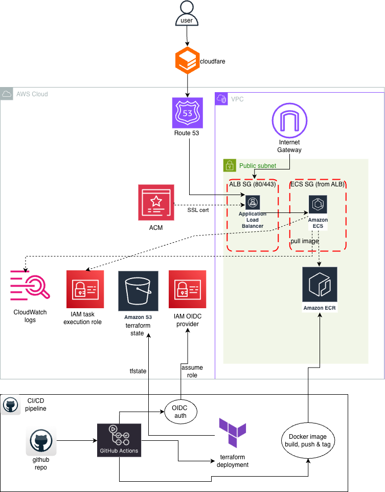
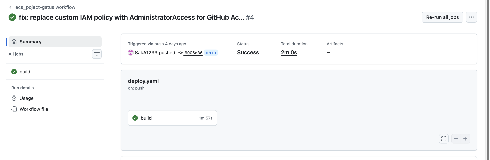
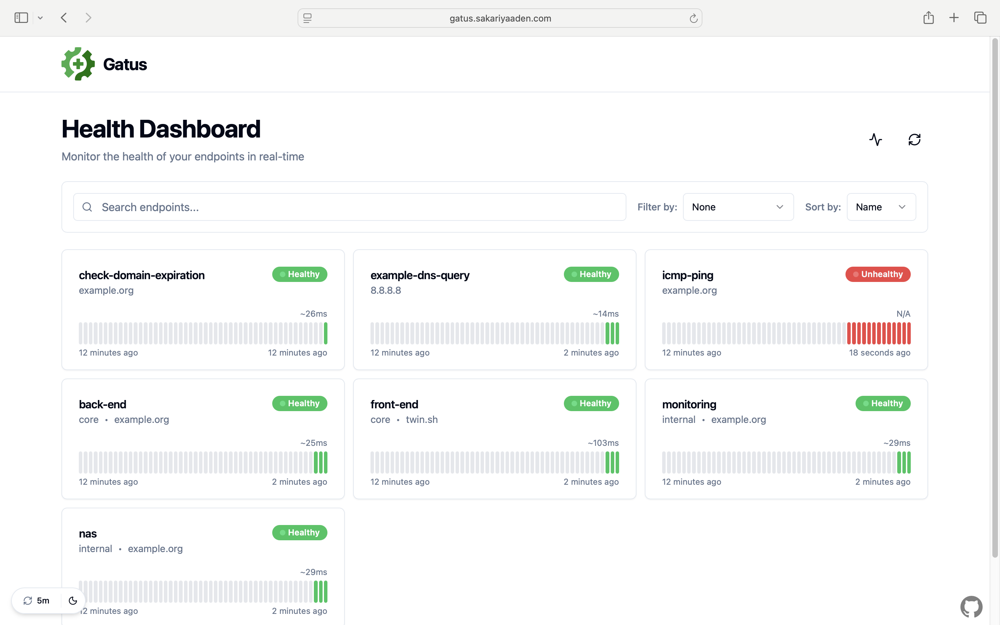
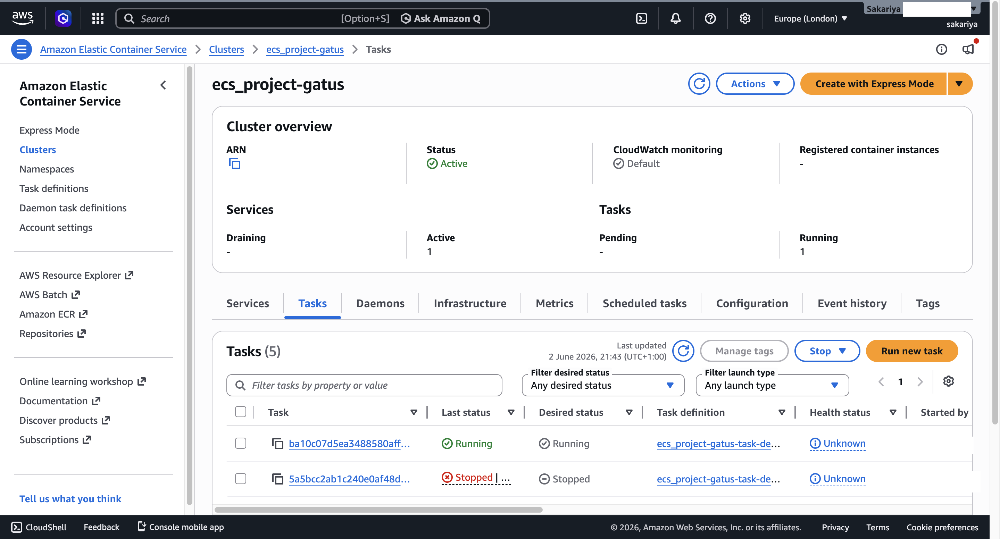
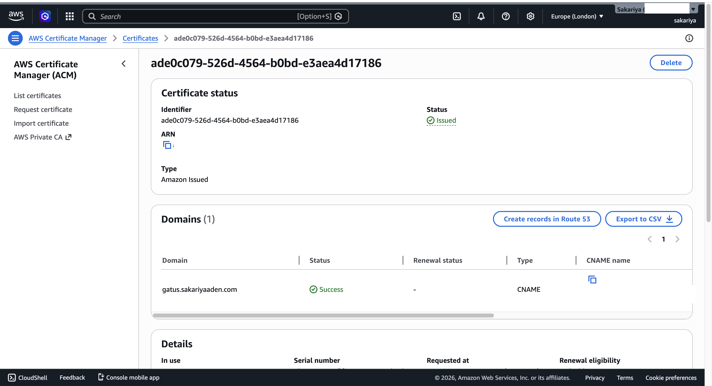
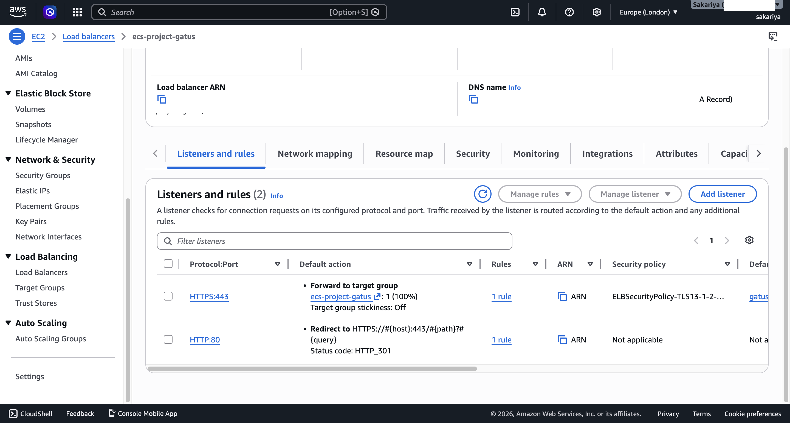
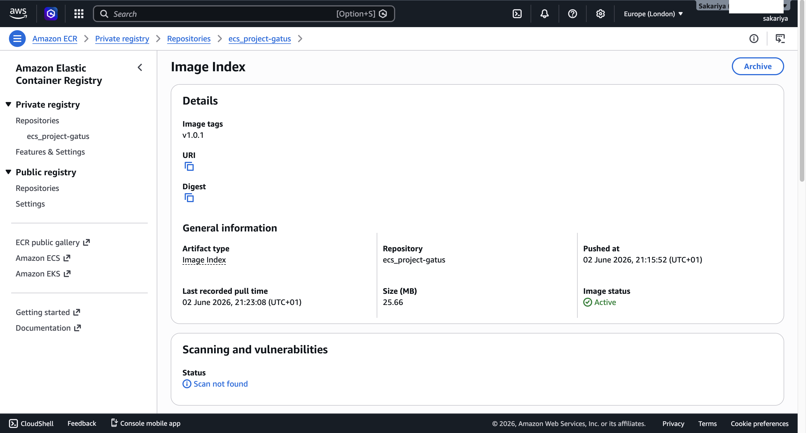
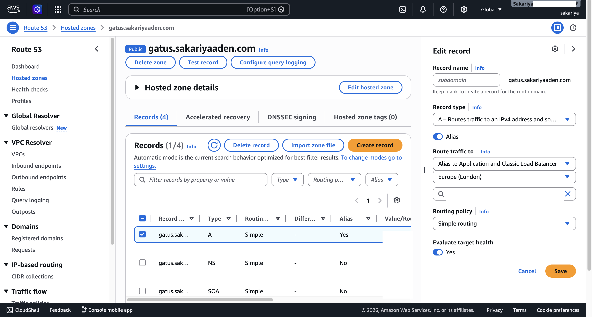

# ECS Fargate Deployment — Gatus Health Monitor

A production-style deployment of [Gatus](https://github.com/TwiN/gatus), an open-source health monitoring dashboard, containerised with Docker and deployed on AWS ECS Fargate with full infrastructure as code and an automated CI/CD pipeline.

**Live URL:** https://gatus.sakariyaaden.com

---

## Overview

This project demonstrates a complete DevOps workflow, going from manual AWS setup (ClickOps) to fully automated infrastructure deployments using Terraform and GitHub Actions.

The application is containerised using Docker, stored in Amazon ECR, and deployed on ECS Fargate behind an Application Load Balancer with HTTPS enforced via ACM. All infrastructure is managed with modular Terraform, and every push to `main` triggers an automated pipeline that builds, pushes, deploys, and health checks the application.

---

## Architecture



### Traffic Flow

```
User → Cloudflare DNS → Route53 → ALB (HTTPS/443) → ECS Fargate (Gatus) → ECR (image pull)
```

### CI/CD Flow

```
GitHub Repo → GitHub Actions → OIDC Auth → Docker Build & Push to ECR
                                         → Terraform init/plan/apply
                                         → Health Check
```

### Key Components

| Component               | Purpose                                                |
| ----------------------- | ------------------------------------------------------ |
| Cloudflare              | DNS management, NS records pointing to Route53         |
| Route53                 | Hosted zone, A record aliased to ALB                   |
| ACM                     | SSL/TLS certificate for HTTPS                          |
| VPC                     | Isolated network with public subnets across 2 AZs      |
| Internet Gateway        | Allows public internet traffic into the VPC            |
| ALB                     | Receives traffic, HTTP→HTTPS redirect, forwards to ECS |
| ALB Security Group      | Allows inbound 80/443                                  |
| ECS Security Group      | Allows inbound from ALB only                           |
| ECS Fargate             | Runs the Gatus container serverlessly                  |
| Amazon ECR              | Private Docker image registry                          |
| CloudWatch Logs         | Container log aggregation                              |
| IAM Task Execution Role | Allows ECS to pull images and write logs               |
| S3                      | Remote Terraform state storage                         |
| IAM OIDC Provider       | Enables keyless GitHub Actions authentication          |

---

## Tech Stack

- **Application:** Gatus (Go-based health monitoring dashboard)
- **Containerisation:** Docker (multi-stage, distroless image)
- **Registry:** Amazon ECR
- **Compute:** AWS ECS Fargate
- **Infrastructure as Code:** Terraform (modular)
- **CI/CD:** GitHub Actions with OIDC authentication
- **DNS:** Cloudflare + Route53
- **TLS:** AWS Certificate Manager
- **Region:** eu-west-2 (London)

---

## Repository Structure

```
.
├── app/
│   └── config.yaml           # Gatus configuration
├── Dockerfile                # Multi-stage distroless build
├── .dockerignore
├── infra/
│   ├── main.tf               # Root module — calls all child modules
│   ├── provider.tf           # AWS provider and backend config
│   ├── variables.tf
│   ├── outputs.tf
│   └── modules/
│       ├── vpc/              # VPC, subnets, IGW, route tables
│       ├── sg/               # Security groups (ALB and ECS)
│       ├── alb/              # Application Load Balancer and target group
│       ├── ecr/              # ECR repository
│       ├── ecs/              # ECS cluster, task definition, Fargate service
│       ├── acm/              # ACM certificate with DNS validation
│       └── route53/          # Hosted zone and A record
├── bootstrap/
│   ├── main.tf               # S3 state bucket, OIDC provider, IAM role
│   ├── provider.tf
│   ├── variables.tf
│   ├── outputs.tf
│   └── terraform.tfvars      # (gitignored)
├── .github/
│   └── workflows/
│       └── deploy.yml        # CI/CD pipeline
├── .gitignore
└── README.md
```

---

## CI/CD Pipeline

The pipeline runs automatically on every push to `main` and consists of the following steps:

1. **Checkout** — checks out the repository
2. **AWS Authentication** — authenticates with AWS via OIDC (no static credentials stored)
3. **ECR Login** — authenticates Docker with the private ECR registry
4. **Docker Build & Push** — builds the image and pushes it tagged with the commit SHA
5. **Setup Terraform** — installs Terraform on the runner
6. **Terraform Deploy** — runs `init`, `plan`, and `apply -auto-approve`
7. **Health Check** — curls the live endpoint and fails the pipeline if unhealthy

### OIDC Authentication

Instead of storing AWS access keys as secrets, the pipeline uses OpenID Connect (OIDC). GitHub issues a short-lived token per workflow run, AWS verifies it against the OIDC provider, and the pipeline assumes an IAM role with temporary credentials that expire when the run ends.



---

## Screenshots

### Gatus Live Dashboard



### ECS Cluster Running



### ACM Certificate Issued



### ALB Listeners (HTTP→HTTPS Redirect)



### ECR Image



### Route53 Record



---

## How to Reproduce

### Prerequisites

- AWS account with CLI configured
- Terraform >= 1.5 installed
- Docker installed
- A domain managed via Cloudflare
- GitHub repository

### Step 1 — Clone the repo

```bash
git clone https://github.com/SakA1233/ecs_project.git
cd ecs_project
```

### Step 2 — Run Bootstrap (one time only)

Bootstrap creates the S3 state bucket and OIDC role before the pipeline can run.

```bash
cd bootstrap
cp terraform.tfvars.example terraform.tfvars
# Fill in your values in terraform.tfvars
terraform init
terraform plan
terraform apply
```

Note the `role_arn` output — you'll need this in the next step.

### Step 3 — Add GitHub Secret

In your GitHub repo → Settings → Secrets and variables → Actions, add:

| Secret         | Value                                |
| -------------- | ------------------------------------ |
| `AWS_ROLE_ARN` | The `role_arn` output from bootstrap |

### Step 4 — Configure Terraform Backend

In `infra/provider.tf`, update the S3 backend bucket name to match what bootstrap created.

### Step 5 — Update Variables

In `infra/terraform.tfvars`, update:

```hcl
project_name  = "your-project-name"
domain_name   = "your-domain.com"
aws_region    = "eu-west-2"
```

### Step 6 — Initialise and Deploy Infrastructure

```bash
cd infra
terraform init   # will ask to migrate state to S3 — type yes
terraform plan
terraform apply
```

### Step 7 — Update Cloudflare NS Records

After Route53 creates a hosted zone, copy the 4 NS records and add them to Cloudflare for your domain.

### Step 8 — Push to main

Any push to `main` now triggers the full CI/CD pipeline automatically.

```bash
git push origin main
```

---

## Key Design Decisions

**ClickOps first, then IaC** — the infrastructure was first built manually via the AWS console to understand how all the components connect, then torn down and rebuilt entirely with Terraform.

**Modular Terraform** — each AWS service area (VPC, ECS, ALB etc.) lives in its own module with clear inputs and outputs, following the principle of separation of concerns.

**OIDC over static credentials** — no AWS access keys are stored anywhere. GitHub authenticates via OIDC, receives temporary credentials scoped to a single workflow run.

**Remote state** — Terraform state is stored in S3 rather than locally, allowing the CI/CD pipeline to access and update state on every run.

**Distroless Docker image** — the container uses a minimal distroless base image, reducing attack surface and image size.

**HTTPS enforced** — HTTP traffic is redirected to HTTPS at the ALB level. ACM handles certificate issuance and renewal automatically.

---

## Costs (approximate)

When running continuously:

| Resource                        | Monthly Cost   |
| ------------------------------- | -------------- |
| ECS Fargate (0.25 vCPU / 0.5GB) | ~$5            |
| ALB                             | ~$16           |
| Route53 hosted zone             | $0.50          |
| ECR storage                     | ~$0.10         |
| **Total**                       | **~$22/month** |

Tear down with `terraform destroy` when not in use to avoid charges.
